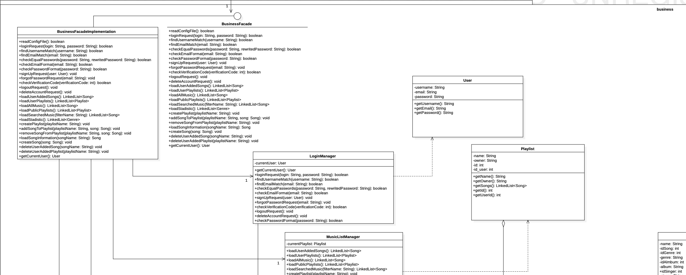

# ESPOTIFAI APP

App for desktop that imitates Spotify, with some different features. It allows each user to create playlists, add music so that it can be seen by everyone, play music through the speakers and many more functionalities.

**Mockup**

Interactive mockup of app, with all the implemented functionalities and screens: https://www.figma.com/proto/KxSvflubHjoMBWCUNndWlu/MockUp-Spotify?node-id=241-262&node-type=canvas&t=bKOU980X3yYq2YsX-1&scaling=scale-down&content-scaling=fixed&page-id=0%3A1&starting-point-node-id=241%3A155

Non interactive mockup of app, with all the implemented screens:  
https://www.figma.com/design/KxSvflubHjoMBWCUNndWlu/MockUp-Spotify?node-id=0-1&t=wHvVzBYNJMgGtWBU-1

**SPECIFICATIONS**

For the correct operation of the program, it must meet the following requirements. The program needs to include the three libraries found in the "libs" folder of the program, which are:

1. jlayer-1.0.1.jar
2. json-simple-1.1.1.jar
3. mysql-connector-java-8.0.23.jar

The first library is used for everything related to music playback, the second for reading the JSON file containing database connectivity information, and the third for reading the SQL database.

Once the application is executed, a song will play directly. This song is the one located in the first position of the playlist `allSongs`. To avoid potential errors, there is a user named Admin who has three songs; some of these should contain lyrics, but at the time of database creation, the lyrics could not be saved because the API to which the system connects had the server out of service. This user also has some playlists, so it can be verified that information about other users is also displayed.

Based on what has been mentioned, the program includes a set of songs that can be selected to be added to the application (these are located in the "Songs" folder of the program). One of the requirements for displaying lyrics is that the information provided by the user about the song must be real and not made up. For the song path, it must be a relative path, i.e., from the IntelliJ folder. Therefore, it should follow the format "Songs/song_name.mp3". Examples of paths we might find in the program include "Songs/Billie Jean.mp3" and "Songs/unVeranoSinTi.mp3", among others.

Finally, it should be noted that if the program is not connected to the database, it will not function since all the information is remotely stored on a web server, where all the application data is kept.

**IMPORTANT:** It is necessary to select "JDK-17" to the project when opening it for the first time.

## Class diagram
The project was developed using a Layered Architecture, with Presentation, Business and Persistence layers. 

*See full class diagram downloading the class_diagram_UML.pdf file that is in the project folder

# Authors
[Pol Valero] (https://github.com/pol-valero)

[Joaquim Balletbo] (https://github.com/QuimBalletbo)

[Oriol Centeno] 

[Adria Estevam]